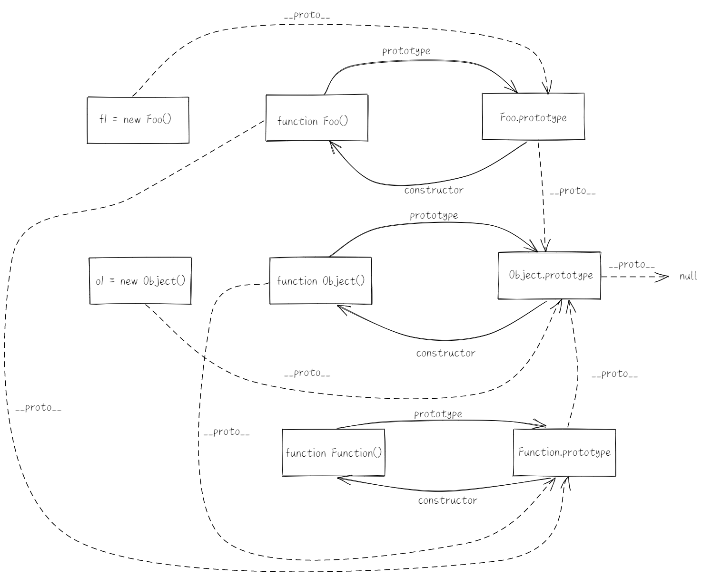

- [高频面试题](#高频面试题)
  - [1. JS有哪些数据类型以及它们的区别](#1-js有哪些数据类型以及它们的区别)
  - [2. JS基本数据类型中null和undefined的区别](#2-js基本数据类型中null和undefined的区别)
  - [3. JS数据类型检测方式有哪些](#3-js数据类型检测方式有哪些)
  - [4. 手写instanceof](#4-手写instanceof)
  - [5. typeof NaN 的结果是什么](#5-typeof-nan-的结果是什么)
  - [6. JS 中判断数组的方法](#6-js-中判断数组的方法)
  - [7. JS 中 \+ 操作符什么时候用于字符串的拼接](#7-js-中--操作符什么时候用于字符串的拼接)
  - [8. JS 中 Object.is() 与比较操作符"\=\=\="和"\=\="的区别](#8-js-中-objectis-与比较操作符和的区别)
  - [9. JS 如何进行隐式转换](#9-js-如何进行隐式转换)
  - [10. 深拷贝和浅拷贝的区别](#10-深拷贝和浅拷贝的区别)
  - [11. JS 中与和或的返回值](#11-js-中与和或的返回值)
  - [12. JS 中 \=\= 操作符的强制类型转换规则](#12-js-中--操作符的强制类型转换规则)
  - [13. JS 中 isNaN 和 Number.isNaN 的区别](#13-js-中-isnan-和-numberisnan-的区别)
  - [14. ES6 中 const 对象的属性可以修改吗](#14-es6-中-const-对象的属性可以修改吗)
  - [15. ES6 中 let、const 和 var 的用法以及区别](#15-es6-中-letconst-和-var-的用法以及区别)
  - [16. JS 中如何判断一个对象是空对象](#16-js-中如何判断一个对象是空对象)
  - [17. ES6 中 new 一个箭头函数会怎么样](#17-es6-中-new-一个箭头函数会怎么样)
  - [18. ES6 中扩展运算符的作用](#18-es6-中扩展运算符的作用)
  - [19. ES6 中的 rest 参数](#19-es6-中的-rest-参数)
  - [20. ES6 中对象和数组的解构](#20-es6-中对象和数组的解构)
  - [21. JS 中 DOM 和 BOM](#21-js-中-dom-和-bom)
  - [22. JS 中函数的 arguments 类数组](#22-js-中函数的-arguments-类数组)
  - [23. JS 如何判断一个对象是否属于一个类](#23-js-如何判断一个对象是否属于一个类)
  - [24. JS 中 forEach 和 map 方法的区别](#24-js-中-foreach-和-map-方法的区别)
  - [25. JS 中如何使用 for ... of 来遍历对象](#25-js-中如何使用-for--of-来遍历对象)
  - [26. JS 中数组的遍历方法](#26-js-中数组的遍历方法)
  - [27. JS 中对原型的理解](#27-js-中对原型的理解)
  - [28. JS 中对原型链的理解](#28-js-中对原型链的理解)
  - [29. JS 中对原型的修改和重写](#29-js-中对原型的修改和重写)
  - [30. for...of 和 for...in 的区别](#30-forof-和-forin-的区别)
  - [31. JS 中如何判断一个属性是属于实例对象还是继承于构造函数](#31-js-中如何判断一个属性是属于实例对象还是继承于构造函数)
  - [32. JS 中 bind 和 call、apply 的作用和它们的区别](#32-js-中-bind-和-callapply-的作用和它们的区别)
  - [33. ES6 中 Promise 的认识](#33-es6-中-promise-的认识)
  - [34. ES6 中 Promise 实例的方法](#34-es6-中-promise-实例的方法)
  - [35. ES6 什么是回调地狱以及如何用 Promise 解决](#35-es6-什么是回调地狱以及如何用-promise-解决)
  - [36. ES6 中 Promise.all 的理解以及应用场景](#36-es6-中-promiseall-的理解以及应用场景)
  - [37. ES6 中 Promise.race 的用法和使用场景](#37-es6-中-promiserace-的用法和使用场景)
  - [38. ES6 中使用 Promise 封装 Ajax](#38-es6-中使用-promise-封装-ajax)
  - [39. JS 中 Ajax 的原理以及如何实现](#39-js-中-ajax-的原理以及如何实现)
  - [40. JS 中如何封装一个 Ajax 请求](#40-js-中如何封装一个-ajax-请求)
  - [41. JS 中对事件流的理解](#41-js-中对事件流的理解)
  - [42. JS 如何阻止事件冒泡和默认行为](#42-js-如何阻止事件冒泡和默认行为)
  - [43. JS 中实现函数的防抖](#43-js-中实现函数的防抖)
  - [44. JS 中实现函数的节流](#44-js-中实现函数的节流)

# 高频面试题

## 1. JS有哪些数据类型以及它们的区别

**基本数据类型**：number, string, boolean, null, undefine, bigInt, symbol；

**引用数据类型**：Object；

**区别**：

1. 基本数据类型存放在**栈**中，引用数据类型存放在**堆**中；
2. 访问基本数据类型时，可以直接操作存放在存放在栈中的值，引用数据类型不可以直接访问堆类型空间，**只能操作存放在栈中的引用地址**；
3. 基本数据类型复制，直接复制值，引用数据类型复制，**复制的是引用地址**。

## 2. JS基本数据类型中null和undefined的区别

这两个类型都表示没有值，区别在于：

1. null表示没有对象，该处**不应该有值**；undefined表示缺少值，该处**应该有**一个值，但是还没有定义。
2. null转为数值为**0**，undefined转为数值的时候为**NaN**。

什么时候有null：

1. 作为函数的参数，表示该函数的参数不是对象；
2. 作为**原型链的终点**。

什么时候有undefined：

1. **变量**被声明了，但是没有赋值，该变量就为undefined；
2. 调用函数时，应该提供的**参数没有提供**，该参数就等于undefined；
3. 对象**没有赋值的属性**，属性的值就为undefined；
4. 函数**没有返回值**得时候，默认返回值就是undefined。

## 3. JS数据类型检测方式有哪些

1. **typeof**（检测数据类型的运算符）--> 无法检测对象，会将null判断为object（浏览器的一个BUG，这是因为所有的值在计算机中都是用二进制编码存储，浏览器将前三位都为0的当做对象处理，null的所有都为0，因此也被当做对象）。
2. **instanceof** （检测某个实例是否属于这个类）--> 可以正确地判断对象的类型，因为内部运行机制就是判断在它的原型链上能不能找到这个类型的原型。**不能判断基本数据类型。不可以检测undefined和null。**
3. **constructor** （检测实例和类的关系，从而检测数据类型）--> 引用原来构造该对象的函数。不可以检测undefined和null。
4. **Object.prototype.toString.call()** （检测数据类型）

## 4. 手写instanceof

```javascript
function myInstanceof (left, right) {
  // 获取目标实例的原型对象
  let proto = Object.getPrototypeOf(left);
  // 获取检测构造函数的原型对象
  const prototype = right.prototype;
  while(true) {
    // 原型对象不存在的时候，就是一直追溯直到Object.prototype._proto_
    if (!proto) {
      return false;
    }
    // 如果找到对应的原型对象
    if (proto == prototype) {
      return true
    }
    // 没找到，到下一级原型中寻找
    proto = Object.getPrototypeOf(proto);
  }
}

const a = myInstanceof([1, 2, 3], Object); // true
console.log(a);
const b = myInstanceof({}, Array); // false
console.log(b);
```

## 5. typeof NaN 的结果是什么

结果为 **number**。

NaN表示不是一个数字（Not A Number），表示是否属于 number 类型的一种状态：是或否，**不是一个确切的值**。

JS中number数据类型除了浮点型和整数型，还有一个特殊的NaN。

NaN，表达式中存在不可转化的变量，并且返回的是一个无效的结果，不是返回确切的值。

NaN **与本身并不相等**，因为它不是一个确切的值，代表的是一个范围。

## 6. JS 中判断数组的方法

1. `Object.prototype.toString.call()`
2. 通过**原型链**做判断，**对象的隐式原型等于构造函数的显式原型**
3. 通过 ES6 的 `Array.isArray()`做判断
4. 通过 `instanceof`做判断
5. 通过`Array.prototype.isPrototypeOf`做判断，判断 Array 是否在传入内容的原型链上。

## 7. JS 中 \+ 操作符什么时候用于字符串的拼接

如果 \+ 操作符**其中一个操作数是字符串**（或者如果是对象，通过`ToPrimitive`操作之后最终得到的字符串），则执行字符串的拼接，否则执行数字加法。

`ToPrimitive` 操作是先使用`valueOf` ，如果结果不是基本数据类型就调用对象的`toString`方法。

注意：函数、数组的`toString`方法结果与对象不同

## 8. JS 中 Object.is() 与比较操作符"\=\=\="和"\=\="的区别

**双等号**（**\=\=**）：如果两边的类型不一致，会**进行强制类型转换**，然后再比较

**三等号**（\=\=\=）：如果两边类型不一致，**不会进行强制类型转换**，直接返回false

注意：三等号判断`NaN`会返回false，判断`+0 === -0`会返回true（这是因为`+`会将不是number的类型转换为number）

`Object.is()`：判断**两个值是否为同一个值**，判断`+0 === -0`会返回false，判断`NaN`会返回true。

## 9. JS 如何进行隐式转换

隐式转换是调用`toPrimitive`方法，方法里面可以传入两个参数，分别为要转换的对象 obj 以及要转换的类型 type 。type可以为 number 或者 string ，默认情况下为 number 。

当为 number 时，先调用 obj 的`valueOf`，如果不是原始值，调用 obj 的`toString`，否则抛出类型错误。

当为 string 时，先调用`toString`，后调用`valueOf`，否则抛出类型错误。

## 10. 深拷贝和浅拷贝的区别

主要区别在于**对对象的复制**，浅拷贝复制的是对象在堆内存中的引用地址，而深拷贝则是将对象在堆中另存到一个新的引用地址上。浅拷贝对其中的对象进行操作会对原始数据产生影响，深拷贝则不会。

深拷贝的实现：

最简单的方法可以**通过JSON对象实现深拷贝**（但是此方法无法解决循环引用的问题）：

* `JSON.stringify`：将 js 的值转为一个 JSON 字符串（因为会重新分配内存）
* `JSON.parse`：用来解析 JSON 字符串，转化为 Object 类型

注意：使用扩展运算符实现的是浅拷贝。

手写深拷贝：

```javascript
function clone(target, map = new Map()) {
    // 判断是否为基本数据类型
    if (typeof target !== 'object' || target === null) {
        return target;
    }
    // 初始化
    const cloneTarget = target instanceOf Array ? [] : {};
    // 防止循环引用
    if (map.get(target)) {
        return map.get(target);
    }
    map.set(target, cloneTarget);
    
    for( key in target) {
        cloneTarget[key] = clone(target[key], map);
    }
    return cloneTarget;
}
```

实际使用的时候一般使用 loadsh 包，引用其中的cloneDeep函数。

## 11. JS 中与和或的返回值

`||`（或）操作符的返回值是拿到的**第一个为truthy**的值，如果一直没有就返回最后一个值。

`&&`（与）操作符的返回值是**第一个为falsy**的值，如果一直没有就返回最后一个值。

## 12. JS 中 \=\= 操作符的强制类型转换规则

首先判断两者的类型是否相同，如果不相同就进行类型转换，相同的话比较大小。

转换规则：

1. **字符串和数字**之间的相等比较，将**字符串转为数字**之后再进行比较；
2. **其他类型和布尔类型**之间的相等比较，先将**布尔值转化为数字**，再用其他规则进行比较；
3. **null 和 undefined** 之间的相等比较，**结果为真**，**其他值**和它们比较都返回**假**；
4. **对象和非对象**之间的相等比较，会将**对象先转为基本数据类型**再进行比较；
5. 如果两个**都为对象**，则**比较是不是指向同一个对象**，如果是则返回 true ，否则，返回 false 。

## 13. JS 中 isNaN 和 Number.isNaN 的区别

`isNaN`：为了判断一个计算结果或者变量的值是否为NaN，使用方法 --> `isNaN(vlaue)`。

isNaN 的判断过程：首先进行类型检测，如果传入的参数不是数值类型，那么就会**将传入的参数转换为数值类型**，然后再进行是否为 NaN 的判断。

`Number.isNaN()`：是 ES6 出来的 Number 对象的扩展的方法。

`Number.isNaN`的判断过程：首先进行类型检测，如果传入的参数不是数值类型，**直接返回 false**， 如果判断是数值类型，然后才调用 `isNaN` 方法进行判断。

## 14. ES6 中 const 对象的属性可以修改吗

是可以的，这是因为 const 保证的不是变量的内容不能改变，而是变量指向的内存地址不能改动。

## 15. ES6 中 let、const 和 var 的用法以及区别

var 如果不在函数中声明，那么声明的是全局变量；使用 var 存在变量提升；使用 var 可以对一个变量进行多次声明； 在函数中 var 声明的变量是局部变量。

 let 声明的变量只在 let 命令所在的代码块中生效；let 不存在变量提升；let 不允许在相同作用域下重复声明。

const 声明的是一个只读的常量，一旦声明，常量的值不可以修改；const 一旦声明就必须赋值；其他都和 let 一样。

区别：

1. var 声明的变量存在**变量提升**的情况，let、const 不存在变量提升；
2. var 可以在**变量声明前使用**，let、const 不可以在变量声明前使用；
3. var 不存在**块级作用域**，let、const 存在块级作用域；
4. var 可以**重复声明**，let、const 不可以重复声明；
5. var 和 let 可以**对变量的值**进行修改，const 声明的是常量，不可以修改。

## 16. JS 中如何判断一个对象是空对象

1. 使用`JSON.stringify()`进行判断（通过结果是否为`{}`字符串进行判断）；
2. 使用`Object.keys()`进行判断（通过返回的数组长度进行判断）。

## 17. ES6 中 new 一个箭头函数会怎么样

会**报错**。

new 关键字的执行过程：

1. new 构造函数会在内存中**创建一个空对象**；
2. **this指向**刚才创建的空对象；
3. 执行构造函数中的代码，**给空对象添加属性和方法**；
4. **返回**这个新的对象（所以构造函数不需要return）。

箭头函数：

1. 箭头函数内的this是**静态**的，指向**定义时所在的对象**，而不是调用时，this指向是不可以改变的，所以箭头函数不可以当做构造函数使用；

## 18. ES6 中扩展运算符的作用

**扩展运算符**（...）的作用：将一个数组变为一个以空格分隔的**参数序列**。

可以用于：

1. **复制**（浅拷贝），包括数组的复制和对象的复制；
2. **合并**，数组的合并，对象的合并；
3. **字符串改为数组**。

## 19. ES6 中的 rest 参数

用于**获取函数多余的参数**。

形式：`(...变量名)`，把用一个分离的参数序列整合为一个数组，**值是一个数组**。

rest 参数只能放在最后一个。

## 20. ES6 中对象和数组的解构

**解构**：一种新的提取数据的模式。

**数组的解构**：以元素的位置为匹配条件，可以在里面留空从而匹配位置。

**对象的解构**：以属性的名称为匹配条件。

## 21. JS 中 DOM 和 BOM

**DOM**：document，**文档对象模型**，用来获取或设置文档标签的属性

JS 可以通过 DOM 获取到有哪些标签，标签有哪些属性，内容有哪些。

DOM 操作的对象是文档，所以 DOM 和浏览器没有关系，关注的是网页本身的内容。

**BOM**: browser object model，**浏览器对象模型**，提供独立于内容而与浏览器窗口交互的对象。

管理窗口与窗口之间的通讯，核心对象是 window。

常用属性：`location`（用于URL相关的操作）、`history`（用于历史相关的操作）、`navigator`（包含了浏览器相关的信息）

**BOM 控制浏览器行为， DOM 控制页面结构**。

## 22. JS 中函数的 arguments 类数组

类数组：与数组相似，但是没有数组常见的方法属性。

如何遍历类数组：

1. 使用 **call 和 apply** 将数组的方法应用到类数组上；
2. 使用`Array.from()`将类数组转化成数组，创建一个新的数组实例；
3. 使用**扩展运算符**将类数组转化为数组。

## 23. JS 如何判断一个对象是否属于一个类

类本身指向就是构造函数，类的数据类型就是函数。

方法：

1. **instanceof** 判断构造函数的 prototype 属性是否出现在对象的原型链的任何位置；
2. 通过对象的 **constructor** 属性来判断，指向对象的构造函数。（但是 constructor 可能被修改）；

## 24. JS 中 forEach 和 map 方法的区别

作用都是**遍历数组**，区别是：

map **会分配内存空间存储新数组并返回**，forEach 则**不会返回执行结果**，返回 undefined。

## 25. JS 中如何使用 for ... of 来遍历对象

`for ... of`允许遍历一个**含有 iterator 接口的数据结构**并且返回各项的值。

当遍历的对象是一个**类数组**的时候，需要使用`Array.from`先转化为数组。

当遍历的对象**不是一个类数组**的时候，需要给对象添加一个`Symbol.iterator`属性，指向迭代器。

iterator遍历过程：

1. 创建一个指针对象，指向当前数据结构的起始位置；
2. 第一次调用指针对象的 next 方法，可以将指针指向数据结构的第一个成员，第二次调用指向第二个成员，以此类推，直至指向结束位置。

每一次调用 next 方法，都会返回数据结构的当前成员的信息，返回一个包含 value 和 done 两个属性的对象。

value：当前成员的值；

done：是一个布尔值，表示遍历是否结束。

添加 iterator 属性示例：

```JavaScript
const obj = {
  name: 'wang',
  age: 13,
  sex: 'man',
  weight: 120
}

obj[Symbol.iterator] = function() {
  const self = this;
  // 拿到对象中的所有 key 值
  const keys = Object.keys(self);
  // 定义数组的下标
  let index = 0;
  return {
    next() {
      if (index < keys.length){
        return {
          value: self[keys[index++]],
          done: false
        }
      } else {
        return {
          value: undefined,
          done: true
        }
      }
    }
  }
}

for(let val of obj) {
  console.log(val);
}
```

## 26. JS 中数组的遍历方法

1. **forEach**：特点是不会改变原数组，**没有返回值**；
2. **map**：特点是不会改变原数组，**有返回值**，返回值是一个数组；
3. **filter**：**过滤数组**，也可以用来遍历，**有返回值**，返回值是一个符合条件元素组成的数组；
4. **for...of**：**返回数组的元素和对象的属性值**，**不可以遍历普通的对象**，因为普通的对象没有 iterator 属性；
5. **reduce**：接收一个函数，作为一个**累加器**。函数有两个参数（实际上有四个），第一个为计算之后返回的值或者初始值，第二个为当前的元素。

## 27. JS 中对原型的理解

prototype 属性，默认对应着一个空对象（没有我们指定的方法和属性），这个空对象就是我们所说的原型对象，每一个 prototype 都是不相等的。

**显式原型**和**隐式原型**：

每一个函数都有一个 `prototype` 属性，就是**显式原型**

每一个实例对象都有一个 `__proto__` ，就是**隐式原型**

实例对象的隐式原型等于对应的构造函数的显式原型的值。

总结：

1. 函数的`prototype`属性是在**函数定义**的时候自动添加的，默认值是一个空对象；
2. 对象的`__proto__`属性是在**创建对象**时自动添加的，默认值是构造函数的`prototype`属性。

## 28. JS 中对原型链的理解

原型链的作用：查找对象的属性和方法。



## 29. JS 中对原型的修改和重写

对原型的**修改**不会影响构造函数的显式原型等于实例对象的隐式原型；

对原型**重写**会影响实例对象的构造函数指向。

## 30. for...of 和 for...in 的区别

1. for...of 遍历获取的是对象的**键值**，for...in 获取到的是对象的**键名**；
2. for...in 会遍历对象的**整个原型链**，for...of 只会遍历**当前对象**；
3. 对于数组的遍历，for...in 返回数组中所有**可以枚举的属性**（就是下标），for...of 返回数组下标对应的**属性值**；
4. for...in 主要为了**遍历对象**产生的，不适合用于遍历数组，for...of 循环可以用来**遍历数组、类数组对象、字符串**等。

## 31. JS 中如何判断一个属性是属于实例对象还是继承于构造函数

通过 `hasOwnProperty()`检测一个属性属于自身对象还是继承于原型链上。

## 32. JS 中 bind 和 call、apply 的作用和它们的区别

**作用**：**改变函数运行时 this 的指向**。

**区别**：

**apply** 接受两个参数，第一个是 this 指向，第二个是函数接收的参数，**必须以数组的形式**进行传入，如果第一个参数为 null 或者 undefined，那么则默认指向 window；

**call** 接收两个参数，第一个是 this 指向，第二个参数是参数序列（不需要以数组的形式），其他和 apply 一样；

**bind** 接收两个参数，和 call 一样，但是 apply 和 call 改变 this 指向，原函数**立即执行**，且是**临时改变** this 指向一次，bind 改变 this 指向**不会立即执行**，返回一个**永久改变** this 指向的函数。

## 33. ES6 中 Promise 的认识

是异步编程的一种解决方案，可以有效避免回调地狱问题。

有**三种状态**：**pending（进行中），fulfilled（已成功），rejected（已失败）**

特点：状态不受外界影响，只有异步操作的结果决定当前状态，一旦状态改变就不会再变（pending --> fulfilled，pending --> rejected）。

**用法**：

Promise 是一个构造函数，用来生成 Promise 实例。

Promise 构造函数接收一个函数作为参数，这个函数有两个参数：resolve 和 reject。

## 34. ES6 中 Promise 实例的方法

**then()**：当实例状态发生改变的时候的回调函数，里面接收两个参数，分别为 resolved 状态执行的函数和 rejected 状态执行的函数。返回的是一个新的 Promise 实例，也就是 Promise 可以链式书写的原因。

**catch()**：用来指定发生错误的回调函数。一般在实际开发中用 catch 替代 then 中的第二个参数。

**finally()**：用来指定不管 Promise 对象状态如何，最后都会执行的操作。

## 35. ES6 什么是回调地狱以及如何用 Promise 解决

**回调地狱**：多个串联的异步操作。

解决方法主要是**通过 Promise 中的 then 解决**的。

## 36. ES6 中 Promise.all 的理解以及应用场景

用来将多个 Promise 实例，包装成一个新的 Promise 实例。

参数可以不是数组，但是必须是 iterator 接口。

Promise.all 创造的 Promise 实例的状态是由所有组成的 Promise 实例决定，只有都为 fulfilled，才会为 **fulfilled**，拿到的为**返回数据组成的数组**。只要有一个为 rejected，那么就为 **rejected**，拿到的数据为**第一个 rejected 的实例返回的数据**。

如果实例作为参数的实例，自己定义了catch方法，那么它一旦是一个 rejected，不会触发 Promise.all 实例的 catch 方法。

作用：将多个请求结果合并在一起。

## 37. ES6 中 Promise.race 的用法和使用场景

只要实例中有一个**先改变状态**，就会把这个实例的参数的返回值传给 Promise.race 实例的回调函数。

## 38. ES6 中使用 Promise 封装 Ajax

```JavaScript
function getJSON(url) {
  return new Promise((resolve, reject) => {
    // 创建一个实例对象
    let xhr = new XMLHttpRequest();
    // 新建一个http请求
    xhr.open('GET', url, true);
    // 发送http请求
    xhr.send(null);
    // 设置状态的监听函数
    xhr.onreadystatechange = function() {
      if (xhr.readyState !== 4) return // 表示请求完成
      // 当请求成功或者失败，需要改变Promise实例的状态
      if (xhr.status >= 200 && xhr.status < 300) {
        resolve(xhr.responseText);
      } else {
        reject(new Error(xhr.statusText));
      }
    }
    xhr.onerror = function () {
      reject(new Error(xhr.statusText))
    }
  })
}

getJSON('http://backend-api-02.newbee.ltd/api/v1/index-infos').then((val) => {
  console.log(JSON.parse(val));
}).catch((reason) => {
  console.log(reason);
})
```

## 39. JS 中 Ajax 的原理以及如何实现

实现过程：

1. 创建 Ajax 的核心对象 XMLHttpRequest 对象，`new XMLHttpRequest()`实例化对象；
2. 通过 XMLHttpRequest 对象的 open() 方法与服务器建立连接，其中有两个必需的参数：method -- 表示请求方式， url -- 服务器的地址；
3. 构建请求所需的数据内容，并通过 XMLHttpRequest 对象的 send() 方法发送给服务器端；
4. 通过 XMLHttpRequest 对象提供的 onreadystatechange 事件监听服务器端的通信状态，主要监听的对象是 实例化对象中的 readyState（五个状态，0表示open()方法未调用，1表示send()未调用，2表示send()已调用，响应头和响应状态已经返回，3表示响应体正在下载 -- responseText 获取到部分数据，4表示整个请求过程已经完毕） 只要 readState 属性值发生改变，onreadyStatechange 被触发。
5. 接收并处理服务端向客户端响应的数据结果；
6. 将接收结果更新到 HTML 页面。

## 40. JS 中如何封装一个 Ajax 请求

没啥好说的

## 41. JS 中对事件流的理解

**事件流**：从页面中接收事件的顺序。

事件流分为三个阶段：**捕获阶段、当前目标阶段、冒泡阶段**。

`addEventListenter(事件, 回调函数, 布尔值（false冒泡，true捕获）)`

**事件捕获**：不太具体的节点先接收到事件，而最具体的节点最后接收事件；

**事件冒泡**：最具体的节点先接收到事件，而不太具体的节点最后接收事件。

## 42. JS 如何阻止事件冒泡和默认行为

事件对象：event 对象，可以当成是一个形参来看，包含了所有与事件相关的信息，比如说触发事件的元素、事件的类型等。

**阻止默认行为**：

1. 调用`preventDefault()`；
2. 考虑兼容性也可以调用`returnValue = false`；
3. 也可以直接`return false`

**阻止事件冒泡**：

1. 在目标元素事件上调用`stopPropagation()`方法；
2. 考虑到兼容性可以调用`cancelBubble = true`；

## 43. JS 中实现函数的防抖

应用场景：

* 登录，发验证码等按钮用户点击太快以至于发送多次请求；
* 调整浏览器窗口大小，resize次数过于频繁，造成计算过多；
* 搜索框搜索输入；

```javascript
function debounce(fn, time) {
	let timer;
	return function() {
		let context = this;
		let args = arguments;
		if (timer) {
			clearTimeout(timer);
		}
		let firstClick = !timer;
		if (firstClick) {
			fn.apply(context, args);
		}
		timer = setTimeout(function(){
			timer = null;
		}, time)
	}
}
```

## 44. JS 中实现函数的节流

节流：减少一段时间的触法频率。

应用场景：

1. scroll：每隔一段时间计算一次位置信息；
2. 搜索框实时搜索并发送请求，展示下拉列表；

**时间戳**：

```javascript
function throttle(fn, time) {
	let begin = 0;
	return function() {
		let date = new Date.getTime();
		let context = this;
		let args = arguments;
		if(date - begin > time) {
			fn.apply(context, args);
			begin = date;
		}
	}
}
```

**定时器**

```javascript
function throttle(fn, time){
	let timer;
	return function() {
		let context = this;
		let args = arguments;
		
		if (!timer) {
			fn.apply(context, args);
			timer = setTimerout(() => {
				timer = null;
			}, time);
		}
	}
}
```

